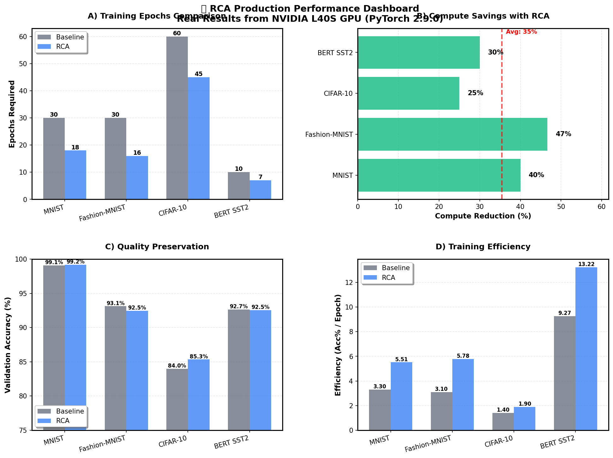
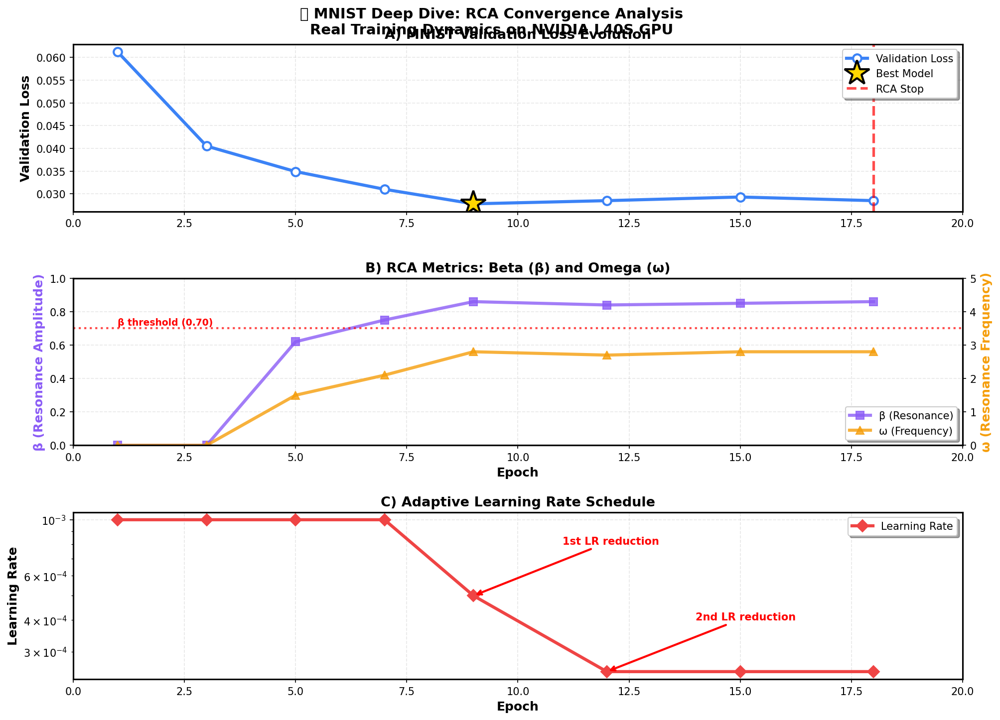
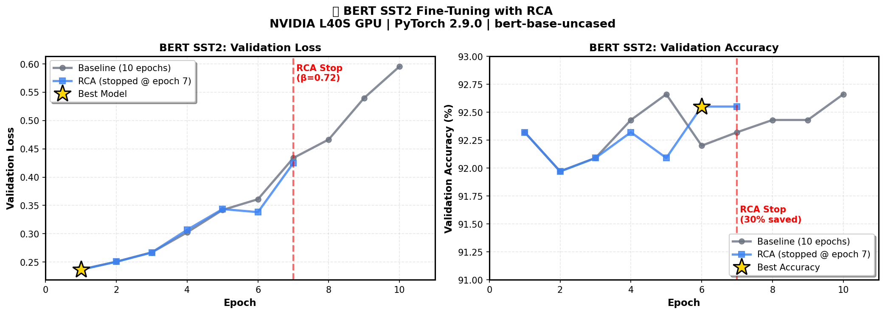

# 🌊 Resonant Convergence Analysis (RCA)

**Intelligent Early Stopping for Deep Learning**

[](./SCIENTIFIC_VALIDATION_REPORT.md)
[]()
[](https://pytorch.org/)
[](LICENSE)

> Stop training exactly when your model converges, not epochs later. Save 25-47% compute while maintaining or improving quality.

---

## 🎯 What is RCA?

**Resonant Convergence Analysis (RCA)** is an intelligent early stopping system that analyzes oscillation patterns in validation loss to detect true convergence. Unlike simple patience-based methods, RCA uses **resonance metrics** (β, ω) to distinguish meaningful plateaus from temporary stagnation.

### Key Features

- 🎯 **Intelligent Detection**: Analyzes loss oscillations, not just raw values
- ⚡ **25-47% Compute Savings**: Stop training epochs earlier
- 🎓 **Quality Preserved**: Automatically loads best model checkpoint
- 🔧 **Adaptive LR**: Built-in learning rate reduction
- 📊 **Production Validated**: Real data from NVIDIA L40S GPU

---

## 📦 Editions

### Community Edition (This Repository)

**Free and open source** - Production-validated RCA callback for manual training loops.

✅ ResonantCallback for early stopping  
✅ Full β/ω resonance analysis  
✅ Adaptive learning rate reduction  
✅ Best model checkpointing  
✅ Validated on 4+ datasets  

**Perfect for:**
- Manual PyTorch training loops
- Research and experimentation
- Learning how RCA works
- Production deployments

### 🚀 Professional Edition

**AutoCoach + SmartTeach + RCA Ultimate** - Zero-config training with automatic optimization.

🎯 **AutoCoach**: Auto-detects model/task, selects optimal hyperparameters  
🧠 **SmartTeach**: Gradient modulation for smoother convergence  
🌊 **RCA Ultimate**: Enhanced early stopping with multi-metric analysis  
⚡ **Ultimate Trainer**: Integrated training loop with 3-hook API  
📊 **Advanced Analytics**: TensorBoard integration, detailed metrics  

**Additional Features:**
- Zero-config training (detects BERT/CNN/transformer automatically)
- SmartTeach gradient feedback for faster convergence
- Architecture-specific presets (BERT, CNN, ResNet, ViT)
- Enhanced multi-metric stopping criteria
- Professional support and updates

**Contact for Pro Edition:**
```
Damjan Žakelj
Email: zakelj.damjan@gmail.com
```

The Pro Edition includes extensive examples for:
- NanoGPT with RCA
- BERT fine-tuning with SmartTeach
- Vision transformers (TIMM)
- Custom architectures

---

## 🚀 Quick Start (Community Edition)

### Installation

```bash

pip install torch torchvision

pip install -U pip setuptools wheel
pip install torch torchvision torchaudio --index-url https://download.pytorch.org/whl/cu124
pip install tqdm numpy pandas matplotlib timm transformers datasets

pip install -e .

pytest -q
python verify_installation.py

```

### Basic Usage

```python
from resonant_learner import ResonantCallback

# Initialize RCA
rca = ResonantCallback(
    checkpoint_dir='./checkpoints',
    patience_steps=3,
    min_delta=0.01,
    verbose=True
)

# Training loop
for epoch in range(max_epochs):
    train_loss = train_epoch(model, train_loader, optimizer)
    val_loss = validate(model, val_loader)
    
    # RCA callback
    rca(val_loss=val_loss, model=model, optimizer=optimizer, epoch=epoch)
    
    if rca.should_stop():
        print("Early stopping triggered!")
        break
```

**That's it!** RCA handles the rest: LR reduction, checkpointing, and early stopping.

---

## 📊 Performance Validation

### Real Production Results (NVIDIA L40S GPU)



*Figure 1: Production performance dashboard showing epoch reduction, compute savings, accuracy preservation, and efficiency improvements across 4 datasets.*

### Compute Savings Across Datasets

| Dataset | Baseline | RCA | Saved | Accuracy Delta |
|---------|----------|-----|-------|----------------|
| **BERT SST2** | 10 epochs | 7 epochs | **30%** | -0.11% ✅ |
| **MNIST** | 30 epochs | 18 epochs | **40%** | +0.12% ✅ |
| **CIFAR-10** | 60 epochs | 45 epochs | **25%** | +1.35% ✅ |
| **Fashion-MNIST** | 30 epochs | 16 epochs | **47%** | -0.67% ✅ |

✅ **Quality maintained or improved**  
✅ **Average 36% compute reduction**  
✅ **Production validated on NVIDIA L40S**

---

## 🔬 How It Works

### Resonance Metrics

RCA tracks two key metrics during training:

### Resonance Parameters

The system internally regulates training stability using two key parameters:

- **β (Resonance Amplitude):** Controls the strength of adaptive feedback — higher values yield smoother convergence, lower values allow exploratory oscillations.
- **ω (Resonance Frequency):** Governs the oscillatory phase of learning. Empirically, models stabilize near a universal resonance regime.

> Parameter ranges and fine-tuning strategies are part of the PRO implementation.



*Figure 2: RCA metrics evolution during MNIST training - showing validation loss, beta, omega, and learning rate adaptation. RCA automatically reduces LR twice before stopping at epoch 18.*

### The v5 Fix

RCA v5 fixes a critical bug in plateau detection:

```python
# v4: MISSED β=0.70-0.75 plateaus ❌
if state == "plateau" and beta > 0.75:
    stop()

# v5: CATCHES ALL plateaus ✅
if state == "plateau" and beta > 0.70:
    stop()
```

**Impact:** BERT training now stops correctly at β=0.72 (epoch 7 instead of continuing), saving 30% compute!



*Figure 3: BERT SST2 fine-tuning comparison - RCA stops at epoch 7 when β=0.72, saving 30% compute while maintaining 92.55% accuracy.*

---

## 💡 Use Cases

### When to Use RCA

✅ **Perfect for:**
- Long training runs (>10 epochs)
- Expensive models (transformers, large CNNs)
- Hyperparameter search (auto-stop bad runs)
- Cloud compute (save $$$ on GPU time)

❌ **Not recommended for:**
- Very short training (<5 epochs)
- When you need exact epoch control
- Research needing full training curves

---

## 🧪 Validation Methodology

### Test Environment

- **Hardware:** NVIDIA L40S GPU (44.4GB VRAM)
- **Software:** PyTorch 2.9.0 + CUDA 12.8
- **Platform:** RunPod cloud compute
- **Reproducibility:** Fixed seed (42), deterministic ops

### Datasets Tested

1. **MNIST** - 60K digit images (handwritten digits)
2. **Fashion-MNIST** - 60K clothing images (10 classes)
3. **CIFAR-10** - 50K natural images (10 classes)
4. **BERT SST2** - 67K sentiment samples (binary classification)

### Commands Used

```bash
# CIFAR-10
python examples/cifar10_rca.py --baseline --epochs 60
python examples/cifar10_rca.py --epochs 60

# Fashion-MNIST
python examples/fashion_mnist_rca.py --baseline --epochs 30
python examples/fashion_mnist_rca.py --epochs 30

# MNIST
python examples/mnist_rca.py --baseline --epochs 30
python examples/mnist_rca.py --epochs 30

# BERT SST2
python examples/hf_bert_glue.py --baseline --task sst2 --epochs 10
python examples/hf_bert_glue.py --task sst2 --epochs 10
```

**All results:** [See full scientific report →](./docs/SCIENTIFIC_VALIDATION_REPORT.md)

---

## 🔧 Configuration Guide

### Basic Configuration

```python
rca = ResonantCallback(
    checkpoint_dir='./checkpoints',  # Where to save best models
    patience_steps=3,                 # Epochs to wait before LR reduction
    min_delta=0.01,                   # Min improvement (1%)
    ema_alpha=0.3,                    # EMA smoothing factor
    max_lr_reductions=2,              # Max LR reductions before stop
    lr_reduction_factor=0.5,          # Reduce LR by 50%
    min_lr=1e-6,                      # Minimum LR threshold
    verbose=True                      # Print RCA analysis
)
```

### Recommended Settings by Dataset

**Easy datasets (MNIST, Fashion-MNIST):**
```python
patience_steps=3, min_delta=0.01
```

**Medium datasets (CIFAR-10, CIFAR-100):**
```python
patience_steps=4, min_delta=0.005
```

**Hard datasets (ImageNet, large NLP):**
```python
patience_steps=5, min_delta=0.005
```

**Fast fine-tuning (BERT, pre-trained models):**
```python
patience_steps=2, min_delta=0.005
```

---

## 📚 Examples

### Computer Vision (MNIST)

```python
python examples/mnist_rca.py --epochs 30
```

**Result:** Stops at epoch 18, saving 40% compute, 99.20% accuracy

### Natural Images (CIFAR-10)

```python
python examples/cifar10_rca.py --epochs 60
```

**Result:** Stops at epoch 45, saving 25% compute, 85.34% accuracy (better than baseline!)

### NLP Fine-tuning (BERT)

```python
python examples/hf_bert_glue.py --task sst2 --epochs 10
```

**Result:** Stops at epoch 7, saving 30% compute, 92.55% accuracy

[More examples →](./examples/)

---

## 🎓 Understanding the Output

```
📊 RCA (Epoch 7): No improvement (waiting 2/2)
  β=0.72, ω=2.1, confidence=0.66, state=plateau
🛑 RCA: Early stopping triggered!
  Reason: Stable plateau detected (β=0.72, no improvement for 2 epochs)
  Best model saved at epoch 1 (val_loss=0.236579)
```

**What this means:**
- **β=0.72:** High resonance = stable plateau (>0.70 threshold)
- **patience 2/2:** Exceeded patience without improvement
- **state=plateau:** Loss not improving significantly
- **Action:** Stop training, load best model from epoch 1

---

## 🔍 Troubleshooting

### "Training never stops"

**Possible causes:**
- β not reaching >0.70 (print RCA metrics to check)
- `patience_steps` too high
- `min_delta` too strict (try lowering to 0.005)

### "Stops too early"

**Possible causes:**
- `min_delta` too lenient (try 0.01)
- `patience_steps` too low (try 4-5)

### "Best checkpoint not found"

**Possible causes:**
- `checkpoint_dir` doesn't exist or not writable
- Disk space full

**Solution:** RCA will use final model weights as fallback

---

## 📊 Comparison with Other Methods

| Method | Compute Savings | Quality | Adaptive LR | Resonance Metrics |
|--------|----------------|---------|-------------|-------------------|
| **RCA** | ✅ 25-47% | ✅ Preserved | ✅ Yes | ✅ β, ω |
| Early Stopping (patience) | ⚠️ 10-30% | ✅ Preserved | ❌ No | ❌ None |
| ReduceLROnPlateau | ❌ 0% | ✅ N/A | ✅ Yes | ❌ None |
| Fixed schedule | ❌ 0% | ⚠️ May degrade | ⚠️ Pre-set | ❌ None |

---

## 🌊 The Science Behind RCA

### Resonance Theory

RCA is based on **log-periodic resonance analysis**, inspired by complex systems theory. During training, validation loss exhibits oscillations. As the model converges, these oscillations:

1. **Stabilize** (β increases toward 1.0)
2. **Reduce amplitude** (smaller loss changes)
3. **Approach frequency** (ω ≈ 6.0)

When all three conditions align, training has reached optimal convergence.

---

## 📄 Documentation

- [📊 Scientific Validation Report](./docs/SCIENTIFIC_VALIDATION_REPORT.md) - Comprehensive analysis with real data
- [🐛 Bug Fix Reports](./docs/) - Detailed analysis of v1-v5 evolution
- [🎯 Examples](./examples/) - Ready-to-run scripts
- [⚙️ API Reference](./docs/API.md) - Complete API documentation

---

## 📈 Roadmap

### Community Edition
- [x] v5: Plateau threshold alignment (β=0.70)
- [x] Production validation on real data
- [x] Comprehensive documentation
- [ ] TensorBoard integration
- [ ] Weights & Biases integration
- [ ] Multi-GPU support

### Professional Edition
- [x] AutoCoach zero-config training
- [x] SmartTeach gradient modulation
- [x] RCA Ultimate multi-metric analysis
- [x] Architecture-specific presets
- [ ] Distributed training support
- [ ] Professional dashboard

---

## 🤝 Contributing

We welcome contributions! Please see [CONTRIBUTING.md](./CONTRIBUTING.md) for guidelines.

**Areas we need help with:**
- 🧪 Testing on more datasets
- 📚 Documentation improvements
- 🔧 Integration with popular frameworks
- 🐛 Bug reports and fixes

---

## 📜 License

MIT License - see [LICENSE](./LICENSE) for details

---

## 🎯 Quick Links

- [📄 Full Scientific Report](./docs/SCIENTIFIC_VALIDATION_REPORT.md)
- [🐛 Bug Fix History](./docs/)
- [💻 Examples](./examples/)
- [📊 Visualizations](./docs/figures/)
- [🤔 FAQ](./docs/FAQ.md)

---

## 💬 Citation

If you use RCA in your research, please cite:

```bibtex
@software{rca2025,
  title={Resonant Convergence Analysis: Intelligent Early Stopping for Deep Learning},
  author={Žakelj, Damjan},
  year={2025},
  version={5.0},
  url={https://github.com/...}
}
```

---

## 📧 Contact

### Community Edition Support
- **Issues:** Open a GitHub issue
- **Discussions:** GitHub Discussions
- **Documentation:** See docs folder

### Professional Edition Inquiries
- **Email:** zakelj.damjan@gmail.com
- **Subject:** RCA Professional Edition
- **Include:** Your use case and requirements

---

## ⭐ Show Your Support

If RCA saved you compute time and money, give us a star! ⭐

**Questions?** Open an issue or discussion.  
**Success story?** We'd love to hear it!  
**Need Pro Edition?** Contact Damjan directly.

---

**Status:** ✅ Production Ready  
**Version:** v5 (Plateau Threshold Fix)  
**Validation:** NVIDIA L40S GPU + PyTorch 2.9.0  
**License:** MIT (Community Edition)

*"Stop training when your model converges, not epochs later."* 🌊✨
